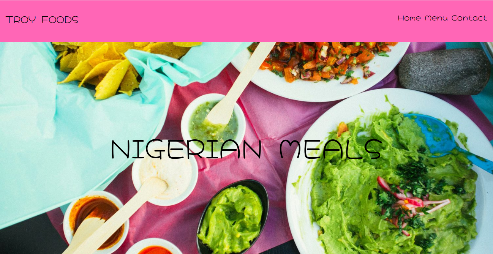

# RESTAURANT PAGE

A simple restaurant site built using Javascript alone to generate its entire content.

## Built With
- JavaScript
- Webpack
- HTML & CSS

## Getting Started
To get a copy up and running follow these simple example steps:-

- Clone https://github.com/okikiola11/restaurant-page.git to your local machine.
- cd into the restaurant-page directory and navigate into the dist directory.

## Usage
- Clone the project to your local machine
- Run npm install
- npm run watch

### Live Demo
<a href="https://rawcdn.githack.com/okikiola11/restaurant-page/8312c7d11ade29b0a0c230e6b367ce1d08ecf9b3/dist/index.html">Click here

## Author
 Okikiola Apelehin

- Github: [@okikiola11](https://github.com/okikiola11)
- Twitter: [@Kikiolla3](https://twitter.com/Kikiolla3)
- Linkedin: [@okikiola-apelehin](https://www.linkedin.com/in/okikiola-apelehin-459008122/)

## 🤝 Contributing

Contributions, issues and feature requests are welcome!

Feel free to check the [issues page](https://github.com/okikiola11/restaurant-page/issues).

## Show your support

Give a ⭐️ if you like this project!

## Acknowledgments

- Google

## 📝 License

This project is [MIT](lic.url) licensed.
